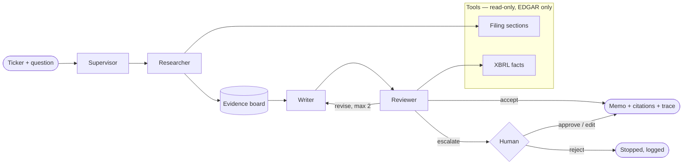
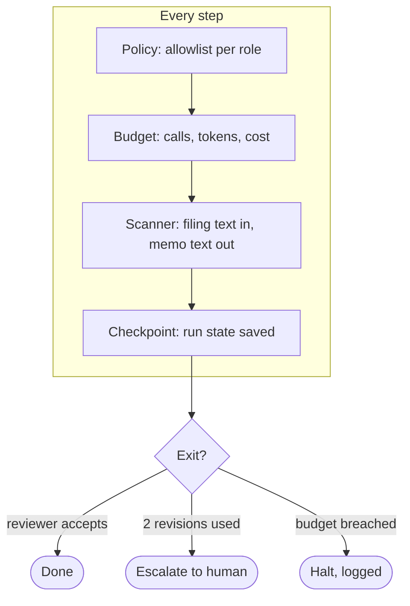

# Filings Research Desk — Part 1 proposal

Will Kotheimer · Agentic AI for Finance capstone · 2026-09-18

## 1. What it is

Given a ticker and a question, the system reads the company's SEC filings and returns a
research memo. Every figure in the memo is traceable to a filed source. The system does not
read prices or news. It does not trade. It does not execute model-generated code.

The workflow it solves is the junior-analyst task: pull what a filing says about a topic,
check the numbers against the structured data, and write it up with citations. Today that
work is slow, and its errors are silent. The system makes the errors visible: each claim
either has a source or the memo says "not in source."

Evaluation uses a fixed roster of nine small-cap companies (BFLY, KDK, POET, LGVN, RXRX,
LUNR, BARK, SOUN, MNTS). Small caps defeat model memorisation: the model knows little about
them, so a correct figure must come from retrieval. The system itself accepts any SEC
registrant.

## 2. Workflow

Question → plan → evidence → draft → review → memo. Read one line per arrow:
- Supervisor turns the question into a plan: which filings, which sections, which facts.
- Researcher fetches sections and writes typed evidence items to the evidence board.
- Writer drafts the memo from the evidence board only.
- Reviewer checks every figure against XBRL and every claim against its citation.
- Human decides only when the reviewer escalates.

## 3. Control

- Every step passes four gates before the next transition is allowed.
- Three exits, all declared: accept, escalate, halt. No other way out.
- The run resumes from its last checkpoint after a crash or a human decision.

## 4. Roles and boundaries

Each role exists because it holds a different context boundary.

| Role | Sees | May call | Decides | Never sees |
|---|---|---|---|---|
| Supervisor | question, roster metadata | none | the plan; routing | filing text |
| Researcher | plan, filing sections | filing tools | which passages are evidence | the memo |
| Writer | evidence board | none | wording of the memo | raw filing text |
| Reviewer | memo, evidence, XBRL facts | XBRL tool, citation check | accept / revise / escalate | — |
| Human | memo, reviewer findings, trace | — | approve / edit / reject | — |

- The writer never sees raw filing text. Injected instructions in a filing cannot reach the
  memo except as a typed evidence item, which the reviewer checks.
- The reviewer is the only role that reads XBRL. Figures are verified, not trusted.
- The supervisor holds no tools. It plans; it does not fetch.

## 5. Decision points

- Supervisor → plan sufficient? If not: one re-plan, then escalate.
- Reviewer → verdict ∈ {accept, revise, escalate}. Revise at most twice.
- Budget → continue or halt. Limits are declared in `governance.md` before the build.
- Human → approve, edit, or reject. The decision is logged with the run id.

## 6. Context, tools, memory

- Context per role: only the columns in section 4. Nothing else is projected into a call.
- Tools: three, all read-only, all EDGAR.
  - `filing_sections(ticker, form, item)` → text with accession and offsets.
  - `xbrl_facts(ticker, concept, period)` → filed value and source.
  - `check_citations(memo, evidence)` → per-claim pass / fail. Deterministic.
- Stretch tool: `runway_simulation(cash_flows, seed)` → P10 / P50 / P90 with assumptions.
  Horizon may not exceed lookback. No price data.
- Memory:
  - Workflow state → LangGraph checkpointer, keyed by run id. Durable.
  - Evidence board → per run. Discarded after the memo.
  - Filing cache → keyed by accession number. Content-addressed, immutable.
  - No memory across runs. Nothing learned from one run reaches the next.

## 7. Human checkpoints

- In the run: the human decides when the reviewer escalates. Approve, edit, or reject.
- In the build: five notebook checkpoints, each run by me before the next milestone.
  1. Filing tools return the expected sections and facts for the roster.
  2. One role end-to-end with a trace.
  3. The full graph with a trace and a checkpoint resume.
  4. The eval suite with scores and baselines.
  5. Every governance rule demonstrated: budget halt, injection blocked, policy denial.

## 8. Components

| Component | Where it is |
|---|---|
| C1 Document retrieval and grounding | researcher tools; citations with accession and offsets |
| C2 Table interpretation | financial-statement tables read as a distinct path from prose; XBRL as the check |
| C5 Tool-using workflow | three declared tools; per-role allowlist; failures classified and recoverable |
| C6 SKILL.md | one skill: how to write a cited memo from an evidence board |
| C7 Evaluation and tracing | golden set from EDGAR; deterministic checks; baselines; stability runs; traces per run |
| C8 Security controls | context boundaries; scanner; allowlists; budget; no code execution |
| C4 Market data (stretch) | seeded runway simulation over XBRL cash flows |

## 9. Evaluation, in brief

- Ground truth comes from EDGAR, never from an agent run.
- Every score is reported beside a baseline: no-retrieval, trivial, and single-agent.
- Negative controls: wrong filings, unanswerable question, poisoned filing.
- Stability: repeated runs; decision labels must not flip.
- Failures are reported, including the ones that stay open.

## 10. Not in scope

- Price data, news, forecasts of any kind.
- Audio, charts, images.
- Trade execution, portfolio state, broker connectivity.
- Model-generated code; therefore no sandbox.
- Memory across runs.
- A user interface, authentication, or deployment beyond Docker Compose.
